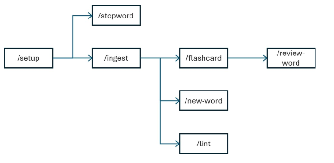
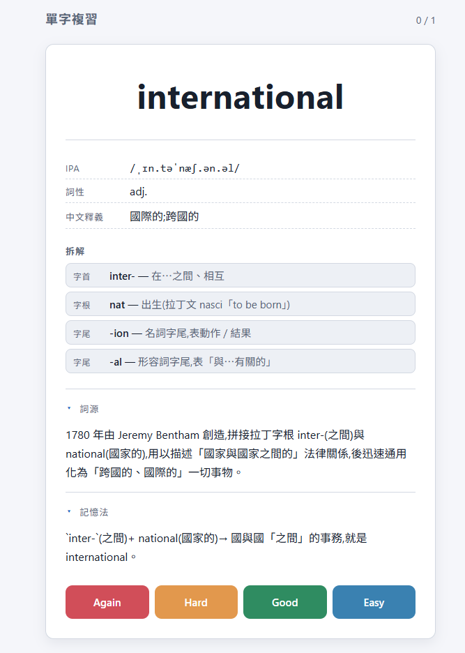

[English](./README.md) | **繁體中文**

# Morphowiki


[](https://opensource.org/licenses/MIT)
[](https://nodejs.org/)

受 Andrej Karpathy 的 LLM Wiki 啟發,**私有化、本地化**的英文構詞知識庫。每位學生用 Claude Code 維護自己的單字庫與複習庫,所有資料留在本機檔案系統。

手冊: [手冊連結](https://morphowiki.pages.dev/?lang=zh-TW)

DOI: https://doi.org/10.5281/zenodo.20587103

---

## 為什麼用 Morphowiki

大型語言模型(LLM)能即時拆解英語構詞(字首/字根/字尾),但輸出停留在一次性對話:無法版本控制、無法累積,也缺乏語素之間的拓樸關係。另一方面,Anki/SuperMemo 擁有成熟的間隔重複(SRS)排程,卻以「孤立卡片」為中心、沒有語素圖譜;Obsidian 提供雙向連結與高度可攜性,卻沒有 LLM 構詞自動化;Quizlet、Membean 等商業平台則資料封閉、不可重現。對 ESL 英語學習者,以及教育科技與應用語言學研究者而言,缺少一個能同時涵蓋上述需求的開放工具。

Morphowiki 把「LLM 遞迴構詞拆解 → Markdown 雙向連結圖譜 → SM-2 排程」封裝成 7 個可重複執行的 Claude Code Agent Skill。所有資料皆以純文字(Markdown/JSON)留在本機,可檢視、可版本控制、可移植。

本表挑選各類別中具代表性、廣為使用的工具進行比較,非窮舉市面所有產品。

| 工具                | LLM 整合 | 構詞拆解 | SRS 排程 | 雙向連結 | 資料可攜性 | 主動策展 |
| ------------------- | :------: | :------: | :------: | :------: | :--------: | :------: |
| Anki                | ✗        | ✗        | ✓        | ✗        | ✓ ᵃ        | ✗        |
| Quizlet             | △        | ✗        | △ ᶠ        | ✗        | △          | ✗        |
| Membean             | ✗        | △ ᵇ      | △ ᶜ      | ✗        | ✗          | ✗        |
| Obsidian + Anki ᵈ   | ✗        | ✗        | ✓        | ✓        | ✓          | △        |
| **Morphowiki**      | **✓**    | **✓**    | **✓**    | **✓**    | **✓**      | **✓**    |

> **符號**:✓ = 原生且完整支援(開箱即用);△ = 部分支援(原生之限付費功能、或官方次要功能);✗ = 不支援(包含須完全依賴第三方社群外掛達成之功能)。**評比基準**:以各工具原生核心功能為準,須靠社群外掛達成者一律記 ✗。
> **主動策展**:系統將「自動驗證」與「資料寫入」分離,僅在使用者明確授權下才變更詞庫(如 `/lint` 僅提示、不自動修改),而非由演算法或平台代為決定學習內容。
> ᵃ Anki 資料可攜性指原生支援純文字與 `.apkg` / `.colpkg` 匯出再匯入,非 API 層級互通。
> ᵇ 「構詞拆解」指對任意輸入單字自動遞迴拆解為字首 / 字根 / 字尾並生成可導航的語素圖譜;Membean 原生提供 morpheme-level 字根教學與 root tree,但僅限平台內既有詞庫、非通用拆解器,故記 △。
> ᶜ Membean 原生提供自適應間隔複習機制,但僅限付費訂閱方案,故記 △。
> ᵈ `+` 表示兩工具搭配使用之工作流(非單一產品);LLM 整合以原生核心設計為準,Obsidian 雖可透過社群外掛接入 LLM,仍記 ✗。
> ᶠ Quizlet「Learn」模式採用類間隔重複的自適應排程,但完整排程控制僅限付費方案,故記 △。

---

## 主要功能

- **嚴格詞源學遞迴拆解**:以 0..N 字首 + 1 字根 + 0..N 字尾的構詞模型拆解單字(如 `international` → `inter-` + `nat` + `-ion` + `-al`),並遞迴收錄中間英文單字(`national`、`nation`)。
- **雙向 wiki-link 語素圖譜**:單字頁與語素頁(prefix/root/suffix)互相回填連結,把孤立詞彙織成可瀏覽、可導航的構詞網路。
- **整句/批次 ingest 自動過濾**:`/ingest` 接受多個單字或整句輸入,自動斷詞並濾除標點、stopwords、已收錄詞與含連字號/撇號/數字的 token。
- **從現有語素池自動造詞**:`/new-word [N]` 嚴格組合既有 prefix/root/suffix,生成 N 個尚未收錄的真實英文單字,並走 ingest 式寫入流程。
- **SM-2 本地複習網頁**:`/review-word` 啟動本機 Node Express 站台(port 5173),翻卡評分後以 SM-2 演算法回寫複習進度,資料留在本機。
- **結構 + 語意一致性檢查**:`/lint` 跑全庫純結構檢查;`/lint <word>` 另對單字加做 LLM 語意檢查(拆解詞源合理性、釋義、詞性、IPA)。
- **loanword 借詞分支**:借詞(`taco`、`sushi`、`karaoke` 等)只建立 `words/` 單字頁、不產生語素頁,永不污染 `/new-word` 造詞池。
- **純文字、可版本控制**:全部字典與複習資料皆為本機 Markdown/JSON,可用 Git 追蹤、可檢視、可移植。

---

## 系統架構

Morphowiki 採三層架構,各層職責清晰、以檔案系統解耦:

1. **生成與維護層(Generation Layer)**:7 個 Claude Code Agent Skill,使用者下指令時才載入執行,負責語素拆解、雙向 link 維護與品質檢查。
2. **資料層(Data Layer)**:`dictionary/` 底下的 Markdown 單字與語素檔,以雙向 wiki-link 構成語素圖譜。
3. **複習層(Review Layer)**:Node.js + 原生 JS 的本地 HTTP server(`server.js`,port 5173)、純前端 SPA(`web/`)、SM-2 卡片庫(`review/flashcards.json`)。

```txt
morphowiki/
├── .claude/skills/             # Generation Layer: 7 Agent Skills
│   ├── setup/  ingest/  new-word/  stopword/
│   └── flashcard/  review-word/  lint/
├── dictionary/                 # Data Layer: Markdown lexicon
│   ├── stopwords.md
│   ├── prefix/   # e.g. inter-.md
│   ├── root/     # e.g. nat.md
│   ├── suffix/   # e.g. -al.md, -ion.md
│   └── words/    # e.g. international.md
└── review/                     # Review Layer: local server
    ├── flashcards.json         # SM-2 progress
    ├── server.js               # Node.js HTTP server (port 5173)
    └── web/                    # SPA frontend (index.html, app.js, style.css)
```

> 七個核心指令的工作流 —— `/setup` 初始化後,主線 `/ingest` → `/flashcard` → `/review-word`,旁支 `/stopword`、`/new-word`、`/lint` 維護詞庫。



---

## 七個 Skill（全部走 Claude Code Skills，不用 Slash Commands）

| Skill                             | 用途                                                                                                                                                                                                                                                                                                                                                                                                                                                                      |
| --------------------------------- | ------------------------------------------------------------------------------------------------------------------------------------------------------------------------------------------------------------------------------------------------------------------------------------------------------------------------------------------------------------------------------------------------------------------------------------------------------------------------- |
| `/setup`                          | 檢查 Node.js、巢狀建立資料夾、直接生成 ~155 個 default stopwords,並從模板複製 `review/server.js` 與前端三檔(**不要與內建 `/init` 混淆** — 內建 `/init` 是生成 CLAUDE.md)                                                                                                                                                                                                                                                                                                  |
| `/ingest <word \| words \| 整句>` | 依詞源學嚴格遞迴拆解(0..N 個 prefix + 1 個 root + 0..N 個 suffix,例:`international` → `inter-` + `nat` + `-ion` + `-al`),產生 zh-TW 釋義、詞性縮寫、IPA、記憶法、空 `## 筆記區`,寫入 `dictionary/words/<word>.md`,維護**雙向 wiki-link**,並遞回 ingest 中間英文單字(如 `national`、`nation`)。整句輸入會自動分詞、過濾標點 / stopwords / 已存在;**Loanword 整字借詞**(`taco`、`sushi`、`karaoke` 等)走 Step 4a 分支:只進 `words/`,不建 morpheme 頁、不污染 `/new-word` 池 |
| `/new-word [N]`                   | 從現有 prefix/root/suffix 池**嚴格組合**生成 N 個(預設 1,上限 20)未收錄的真實英文單字,各自走 ingest 風格寫入流程,但**不**遞回中間單字。**morpheme stem 字面比對**,不可動態組裝複合字尾(如 `-ation`)。Step 2.5 **morpheme 池防呆過濾**:讀 `.claude/skills/new-word/morpheme-flags.md` 的 `## blocked` 永久封鎖清單,再對未提及的 root 跑 self-check 排除 loanword,結果自動 append 回 morpheme-flags.md                                                                      |
| `/stopword <word>`                | 把太簡單的字加入 `dictionary/stopwords.md` 的 `## custom`,之後 ingest 會擋                                                                                                                                                                                                                                                                                                                                                                                                |
| `/flashcard <word>`               | 加進 `review/flashcards.json`(SM-2 間隔重複);亦可 `remove`、列表                                                                                                                                                                                                                                                                                                                                                                                                          |
| `/review-word`                    | 啟動本地 Node Express 網頁(port 5173)翻卡、評分、回寫進度;缺檔請先跑 `/setup`                                                                                                                                                                                                                                                                                                                                                                                             |
| `/lint [word]`                    | 字典結構檢查。無參數=全庫純結構檢查(無 LLM、僅報不修);帶 word=結構檢查 + LLM 語意檢查(拆解 / 釋義 / 詞源-拆解 consistency / 詞性 / IPA),列出建議後問你套用哪幾條                                                                                                                                                                                                                                                                                                          |

---

## AI agent 相容性

七個 skill 遵循 Agent Skills 開放標準,**Claude Code**、**Google Antigravity**、**GitHub Copilot** 都能直接從 `.claude/skills/` 使用,免設定。唯獨 **Codex**:首次使用時會預設詢問是否載入 skill,允許後它會自動轉換成自己的 skill 資料夾。

---

## 前置需求

| 需求 | 版本 | 用途 |
|---|---|---|
| Claude Code | CLI / 桌面 / IDE 插件 | 觸發 7 個 skills + LLM 語素分析 |
| Node.js | ≥ 18 | 僅供 `/review-word` 的本地 server 使用 |
| 瀏覽器 | 任一現代瀏覽器 | 開啟 http://localhost:5173 複習 |

## 快速開始

```bash
git clone https://github.com/yaoting-chen/Morphowiki.git
cd Morphowiki
```

用 Claude Code 開啟此資料夾後,七個 skills 自動載入:

1. `/setup` — 第一次使用先跑;之後可省略
2. `/ingest unbelievable` — 看 `dictionary/` 自動長出單字頁與反向關聯
3. `/flashcard unbelievable` — 加進複習庫
4. `/review-word` — 瀏覽器打開 http://localhost:5173 複習
5. `/new-word 3` — 用現有字根快速擴庫,一次生 3 個字

---

## 一次處理多個字(空白分隔 / 整句)

`/ingest`、`/stopword`、`/flashcard` 都支援一次給多個字,以空白分隔,各自獨立執行(中途失敗的會被略過、其他照常)。`/ingest` 進一步支援**整句**輸入 — 自動分詞、過濾標點、stopwords、已存在單字,以及含連字號 / 撇號 / 數字的非純字母 token(`t-shirt`、`don't`、`5g` 等不收):

```
/ingest enable defender                            # 收 enable、defender 兩個字
/ingest The international project was a success.   # 整句:自動跳過 the/was/a;只收 international、project、success
/stopword cat ball                                  # 把 cat、ball 加進 custom stopwords
/flashcard enable defender                          # 把這兩個字加進複習庫
```

---

## 範例：`/ingest international` 產出什麼

執行 `/ingest international` 時,Morphowiki 會遞迴拆解並依序建出 `nation` → `national` → `international`,將完整單字頁寫入 `dictionary/words/international.md`,再把 `[[../words/international]]` 反向連結回各語素頁,形成雙向 wiki-link。

實際產物 `dictionary/words/international.md`:

````markdown
---
word: international
pos: adj.
ipa: /ˌɪn.təˈnæʃ.ən.əl/
added: 2026-05-21
---
# international

**詞性**: adj.
**IPA**: /ˌɪn.təˈnæʃ.ən.əl/
**中文釋義**: 國際的; 跨國的

## 拆解
- 字首: [[../prefix/inter-]] `inter-` — 在…之間、相互
- 字根: [[../root/nat]] `nat` — 出生(拉丁 nasci「to be born」)
- 字尾: [[../suffix/-ion]] `-ion` — 名詞字尾
- 字尾: [[../suffix/-al]] `-al` — 形容詞字尾

## 詞源
...

## 記憶法
...

## 筆記區
````

同時,`dictionary/prefix/inter-.md` 的 `## Words containing this` 會自動補上 `[[../words/international]]`(雙向)。

---

## 複習介面截圖



卡片背面顯示 IPA、詞性、中文釋義與語素拆解;詞源與記憶法以手風琴(accordion)收合。底部四個 SM-2 評分鈕 **Again / Hard / Good / Easy** 評分後即回寫間隔重複進度。

---

## 可重現性

- **非決定性提醒**:構詞拆解由 LLM 產生,相同輸入在不同模型版本下,詞源敘述可能略有差異;但結構面(frontmatter、section、雙向連結、拆解格式)是決定性的,並由 `/lint` 驗證。
- **環境**:Node.js ≥ 18;LLM = Claude(論文使用之模型版本:`Opus 4.7`)。
- **狀態可攜**:所有詞庫狀態皆為 `dictionary/` 下的純 Markdown 與 `review/flashcards.json`,完全可版本控制;clone 該 repo 即等於完整重現詞庫狀態。
- **重現論文範例**:執行 `/setup`,再執行 `/ingest international`,比對產生的 `dictionary/words/{nation,national,international}.md` 與論文 §3.2。

## 驗證

本專案無 build 流程與單元測試;結構完整性由 skill 驗證:

- **`/lint`** — 全庫結構檢查:雙向 wiki-link 對稱性、frontmatter 必要欄位、四個 section 是否存在、拆解格式與 `server.js` 解析規則是否同步、stopword 衝突、`flashcards.json` 一致性、語素引用完整性。不呼叫 LLM、唯讀、只報不修。
- **`/lint <word>`** — 在結構檢查之外,額外對單一單字做 LLM 語意檢查:拆解詞源合理性、釋義準確性、詞源段與拆解的 consistency、詞性、IPA。

---

## 已知限制

- **Token 成本隨詞庫成長**:`/new-word` 與語意型 `/lint <word>` 在大型詞庫下成本升高,目前尚未引入索引、快取或檢索機制。
- **模型依賴與幻覺風險**:拆解品質取決於 LLM,可能產生誤拆;透過 `/lint`、單字存在性檢查與 human-in-the-loop 可降低風險,但無法完全消除。
- **目標語言特定**:skills 專為英語構詞設計,遷移至其他語言需重新設計拆解規則、語素分類與驗證提示。

---

## 授權

本專案採 MIT 授權,詳見 [LICENSE](./LICENSE)。

## 貢獻與支援

歡迎在本 repo 的 [Issues](https://github.com/yaoting-chen/Morphowiki/issues) 提出問題並送出 PR。  
問題聯絡：yaoting.chen.academic@gmail.com

---

## Q&A

### Q1: 為什麼這套 SM-2 實作只有 4 個按鈕？

[原始 SM-2](https://super-memory.com/english/ol/sm2.htm) 雖定義了 0–5 共 6 個評級，但依據其 Rule 6，**評分 < 3 處理結果完全等價**（連續次數歸零、間隔重設為 1 天、且不改變 Ease）。為減少使用者的「抉擇疲勞」，我們將忘記的狀態合併為單一的 `Again` 按鈕。

只有在成功回想時，系統才會調整長期難度：`Hard` (-0.14) / `Good` (不變) / `Easy` (+0.10)。更重要的是，本作的 `Again` 嚴格遵守「**不扣除 Ease**」（僅防呆保底 1.3）的原始設計，這能有效防止使用者因一時的恍神，讓卡片掉入無法翻身的「Ease Hell（易忘地獄）」。
